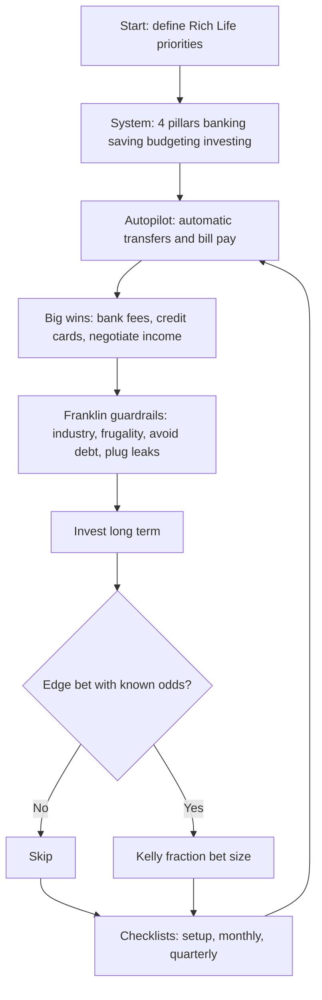

# Personal Finance Flow

```mermaid
flowchart TD
  A[Start: define Rich Life priorities] --> B[System: 4 pillars banking saving budgeting investing]
  B --> C[Autopilot: automatic transfers and bill pay]
  C --> D[Big wins: bank fees, credit cards, negotiate income]
  D --> E[Franklin guardrails: industry, frugality, avoid debt, plug leaks]
  E --> F[Invest long term]
  F --> G{Edge bet with known odds?}
  G -- No --> H[Skip]
  G -- Yes --> I[Kelly fraction bet size]
  H --> J[Checklists: setup, monthly, quarterly]
  I --> J
  J --> C
```
